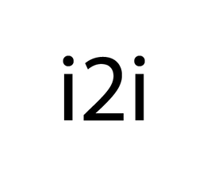

#  image2icon

**image2icon** is my personal tool for create icns and ico. I created this application to help speed up the process of converting png to icns or ico. This application was originally for learning rust integration to python with safer_ffi. If you want to use it please download or compile from source.

## 🤝 Contributing

Contributions are welcome! If you'd like to improve image2icon or add new features, please open an issue or submit a pull request.

---

## ❓ Need Help?

If you experience issues or have questions, please check the **[Wiki](https://github.com/ziprangga/image2icon/wiki)** or open an issue.
